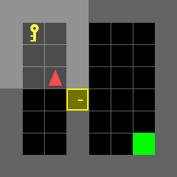

# Hierarchical DQN for MiniGrid DoorKey
Using H-DQN, train agent to find the key, open the door, and finally reach the end point in a MiniGrid environment

## Introduction
1. Creat virtual enviroment (Using conda)
```
conda create -n hdqn-env python=3.8 <br>
conda activate hdqn-env <br>
```
2. Install 'MiniGrid' enviroments and relevant libraries
```
pip install -r requirements.txt
```

## How to use
1. Setting the appropriate parameters in file 'hdqn_mdp.py', especially the network of meta controller and controller
2. Setting the appropriate parameters and the save path in file 'run_hqdn.py' for different MiniGrid map
3. Running the file 'run_hdqn.py'
4. Setting the the name and path of saved model for testing and visualization
5. Running th file 'test' and check the success rate and visual results

## Example
<p align="center"></p>
